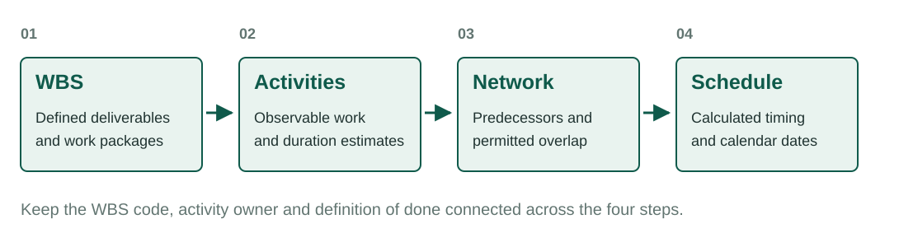
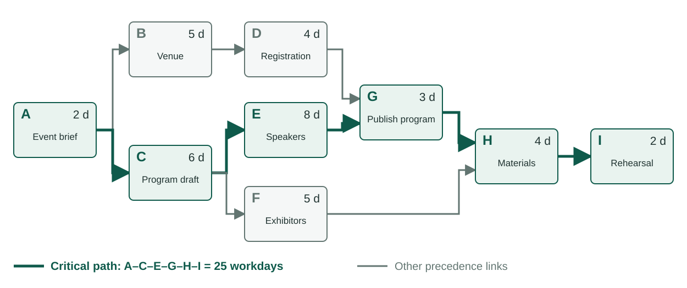
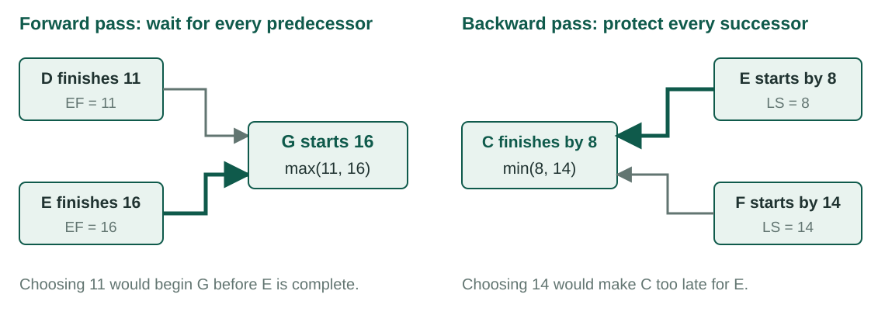
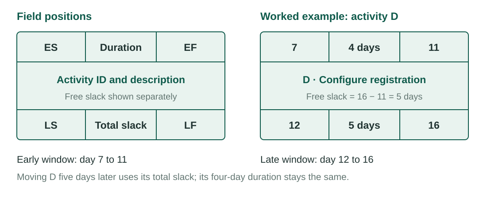
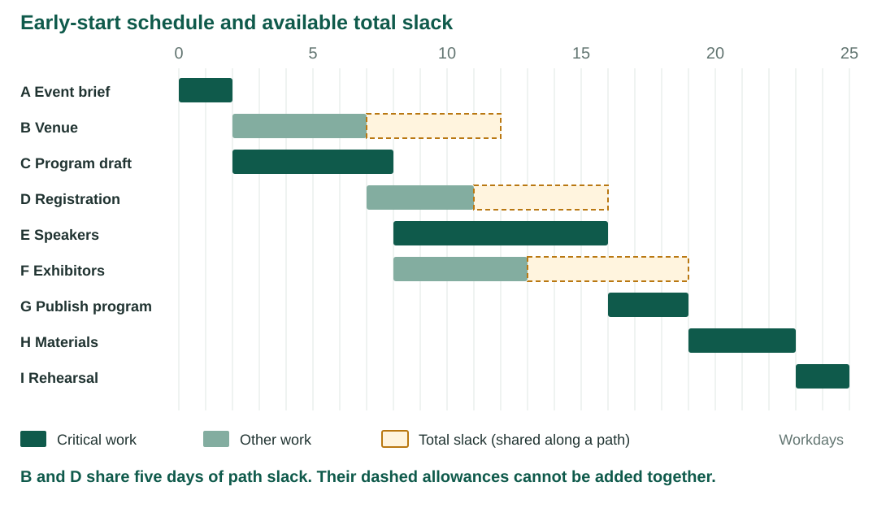
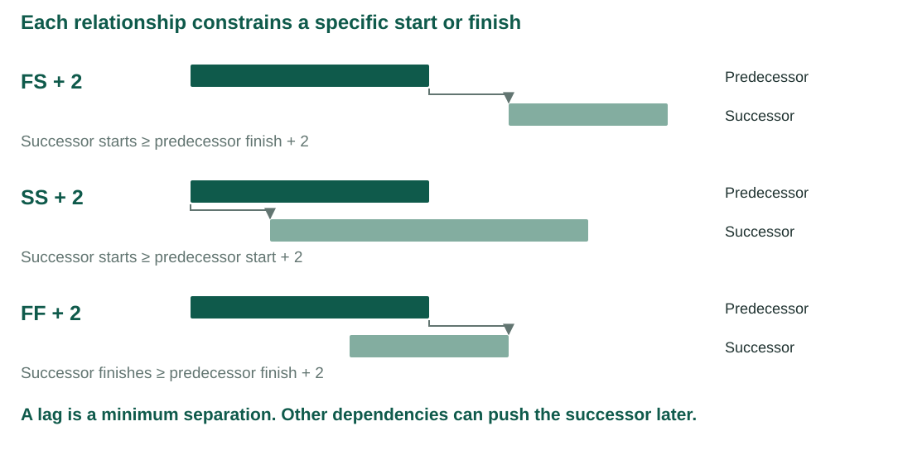
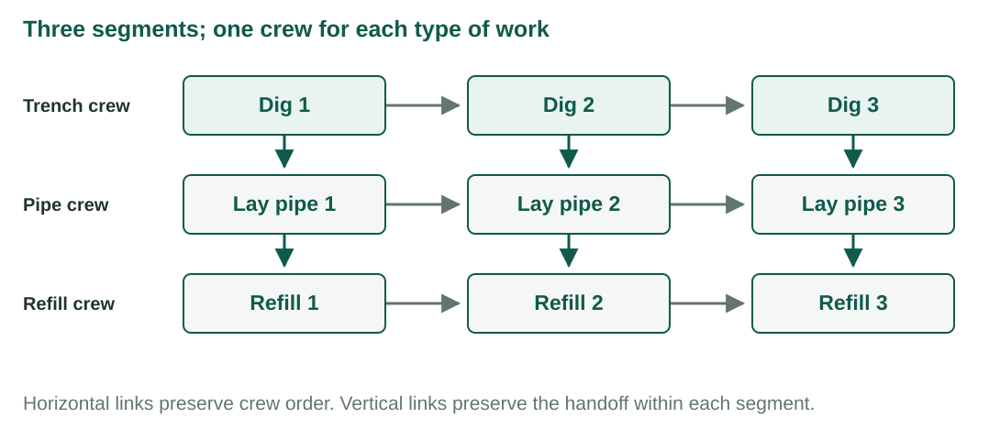

## {.center}

> The project network turns a list of work into a time-based plan.

*Following Larson & Gray, Ch. 6 [1]. Conference examples are original to this course.*

## Learning objectives

| | |
|---|---|
| **LO 6-1** | Link the WBS to the project network |
| **LO 6-2** | Construct and interpret an AON network |
| **LO 6-3** | Calculate early and late activity times |

## Learning objectives

| | |
|---|---|
| **LO 6-4** | Identify and manage the critical path |
| **LO 6-5** | Distinguish total slack from free slack |
| **LO 6-6** | Model overlap and waiting with lags |

# LO 6-1 · From WBS to network

::: {.aside}
Following Larson & Gray, Ch. 6
:::

## The WBS defines the work

Each work package has:

- a defined result;
- an owner;
- resource and cost estimates; and
- a duration estimate.

. . .

The WBS does not define the sequence.

## Network schedule logic

<figure>

</figure>

## What the network adds

| Question | Network information |
|---|---|
| What must happen first? | Dependencies |
| What can happen together? | Parallel activities |
| When can work start and finish? | Activity timing |
| What controls the project finish? | Critical path |
| How much delay can the plan absorb? | Slack |

## Continuity between planning steps

The people who defined the work packages should help define the network activities.

. . .

A separate scheduling handoff can lose deliverables or dependencies.

. . .

Software cannot repair missing project logic.

## Work, events and constraints

| Element | Conference example | Schedule meaning |
|---|---|---|
| Work package | Registration capability | Defined scope and owner |
| Activity | Configure registration | Work with a duration |
| Milestone | Registration opens | Event with zero duration |
| Dependency | Venue before registration setup | Required order |

## Baseline CPM assumptions

| Assumption | Implication |
|---|---|
| Fixed durations for this calculation | Update them when estimates change |
| FS relationships with zero lag | Finish before the successor starts |
| Sufficient resources | Parallel work is actually feasible |
| Common work calendar | Compare workdays consistently |
| No imposed early deadline | Set final LF equal to final EF |

## What the network provides

- project duration based on the work
- earliest and latest activity times
- a basis for labor and equipment schedules
- visibility into critical and flexible work
- a structure for schedule updates

# LO 6-2 · Activity-on-node networks

::: {.aside}
Following Larson & Gray, Ch. 6
:::

## Network vocabulary

| Term | Meaning |
|---|---|
| Activity | A project element that consumes time |
| Parallel activities | Activities that may occur at the same time |
| Burst | More than one immediate successor |
| Merge | More than one immediate predecessor |
| Path | A connected sequence of dependent activities |

## AON construction rules

1. Flow from left to right.
2. Finish required predecessors before the successor begins.
3. Give every activity a unique ID.
4. Keep IDs after their predecessors when practical.

## AON construction rules

5. Do not create loops.
6. Keep conditional branches outside the deterministic network.
7. Use lines to show precedence and flow.
8. Use one start and one finish when they improve clarity.

## Conference activities

| ID | Activity | Predecessor | Days |
|:--:|---|:--:|--:|
| A | Approve event brief | — | 2 |
| B | Contract venue | A | 5 |
| C | Draft program | A | 6 |
| D | Configure registration | B | 4 |
| E | Confirm speakers | C | 8 |

## Conference activities

| ID | Activity | Predecessor | Days |
|:--:|---|:--:|--:|
| F | Recruit exhibitors | C | 5 |
| G | Publish program | D, E | 3 |
| H | Prepare on-site materials | F, G | 4 |
| I | Complete rehearsal | H | 2 |

## The precedence map

<figure>

</figure>

## Reading the network

- A and C are burst activities.
- G waits for both D and E.
- H waits for both F and G.
- Arrow length does not represent elapsed time.
- A complete path follows connected links from A to I.

## A schedule can calculate the wrong project

If G lists only E as a predecessor, the software may allow the program to publish before registration is configured.

. . .

The arithmetic can be correct while the dependency model is wrong.

# LO 6-3 · Forward and backward passes

::: {.aside}
Following Larson & Gray, Ch. 6
:::

## Forward pass

**EF = ES + duration**

. . .

At a merge:

**ES = largest predecessor EF**

## Time zero and working time

| Item | Meaning |
|---|---|
| ES = 0, duration = 2 | Work occupies the interval 0–2 |
| EF = 2 | A successor can start at time 2 |
| Calendar display | Start and end dates may be inclusive |
| Workday duration | Excludes nonworking periods in the calendar |

Do not add a day at each handoff.

## Early times through the first split

| ID | ES | Duration | EF |
|:--:|--:|--:|--:|
| A | 0 | 2 | 2 |
| B | 2 | 5 | 7 |
| C | 2 | 6 | 8 |
| D | 7 | 4 | 11 |
| E | 8 | 8 | 16 |
| F | 8 | 5 | 13 |

## A merge uses the largest EF

G waits for D and E.

**ES(G) = max(11, 16) = 16**

**EF(G) = 16 + 3 = 19**

. . .

E controls the early start of G.

## Earliest project finish

| ID | Predecessor EF values | ES | Duration | EF |
|:--:|---|--:|--:|--:|
| G | D = 11, E = 16 | 16 | 3 | 19 |
| H | F = 13, G = 19 | 19 | 4 | 23 |
| I | H = 23 | 23 | 2 | 25 |

. . .

The earliest project finish is day **25**.

## Backward pass

Set the final late finish equal to the planned project finish.

**LS = LF − duration**

. . .

For multiple successors:

**LF = smallest successor LS**

## Late times from the finish

| ID | LF | Duration | LS |
|:--:|--:|--:|--:|
| I | 25 | 2 | 23 |
| H | 23 | 4 | 19 |
| G | 19 | 3 | 16 |
| F | 19 | 5 | 14 |
| E | 16 | 8 | 8 |
| D | 16 | 4 | 12 |

## A burst uses the smallest successor LS

C precedes E and F.

**LF(C) = min(8, 14) = 8**

**LS(C) = 8 − 6 = 2**

. . .

E controls the late finish of C.

## Why max forward and min backward?

<figure>

</figure>

## Reading an activity node

<figure>

</figure>

## Calculation checks

| Check | Required result |
|---|---|
| EF − ES | Duration |
| LF − LS | The same duration |
| LS − ES | Equal to LF − EF |
| Successor ES | At least every predecessor EF |
| Longest complete path | Project duration |

These checks assume finish-to-start relationships with zero lag.

## Complete activity record

| ID | ES | EF | LS | LF | TS |
|:--:|--:|--:|--:|--:|--:|
| A | 0 | 2 | 0 | 2 | 0 |
| B | 2 | 7 | 7 | 12 | 5 |
| C | 2 | 8 | 2 | 8 | 0 |
| D | 7 | 11 | 12 | 16 | 5 |
| E | 8 | 16 | 8 | 16 | 0 |

## Complete activity record

| ID | ES | EF | LS | LF | TS |
|:--:|--:|--:|--:|--:|--:|
| F | 8 | 13 | 14 | 19 | 6 |
| G | 16 | 19 | 16 | 19 | 0 |
| H | 19 | 23 | 19 | 23 | 0 |
| I | 23 | 25 | 23 | 25 | 0 |

# LO 6-4 · Critical path

::: {.aside}
Following Larson & Gray, Ch. 6
:::

## Path durations

| Complete path | Days |
|---|--:|
| A – B – D – G – H – I | 20 |
| A – C – E – G – H – I | **25** |
| A – C – F – H – I | 19 |

. . .

The longest path controls the planned finish.

## Critical activities have zero total slack

**A – C – E – G – H – I**

. . .

A one-day delay on this path delays the planned project finish by one day unless time is recovered elsewhere on the path.

## The path that was not critical

D takes three additional days.

| Before | After |
|---:|---:|
| D finishes day 11 | D finishes day 14 |
| E finishes day 16 | E finishes day 16 |
| G starts day 16 | G starts day 16 |

. . .

The project still finishes on day 25.

## Equal delay, different effect

E takes three additional days.

| Before | After |
|---:|---:|
| E finishes day 16 | E finishes day 19 |
| G starts day 16 | G starts day 19 |
| Project finishes day 25 | Project finishes day 28 |

## Critical does not mean expensive

The critical path identifies the sequence that controls duration.

. . .

It does not identify the most expensive, difficult or strategically important work.

. . .

Network position and risk exposure answer different questions.

## The critical path can change

| Change to D from baseline | Venue path | Program path | Project finish |
|---|--:|--:|--:|
| No change | 20 | 25 | 25 |
| Add 3 days | 23 | 25 | 25 |
| Add 5 days | 25 | 25 | 25 |
| Add 6 days | 26 | 25 | 26 |

At a tie, both paths are critical. Recalculate after each change.

## Limits to schedule compression

| Change to E from baseline | Program path | Venue path | Project duration |
|---|--:|--:|--:|
| No change | 25 | 20 | 25 |
| Remove 2 days | 23 | 20 | 23 |
| Remove 6 days | 19 | 20 | 20 |

Shortening E eventually makes the venue branch controlling.

# LO 6-5 · Total and free slack

::: {.aside}
Following Larson & Gray, Ch. 6
:::

## Total slack

The delay an activity can absorb without delaying the project finish.

**TS = LS − ES = LF − EF**

. . .

Slack used by one activity reduces the slack available to later activities on the same path.

## Work and slack on a time axis

<figure>

</figure>

## Free slack

The delay an activity can absorb without delaying an immediate successor's early start.

**FS = smallest successor ES − EF**

. . .

Free slack is nonnegative in a feasible baseline FS schedule.

## The distinction

| Activity | Total slack | Free slack |
|:--:|--:|--:|
| B | 5 | 0 |
| D | 5 | 5 |
| F | 6 | 6 |

. . .

B can slip without delaying the project, but its successor D moves immediately.

## Slack requires coordination

Total slack belongs to the path.

. . .

Free slack can be used without changing an immediate successor's early start.

. . .

Neither value is permission to delay work without considering resources and risk.

## Shared slack in the venue branch

| Timing | B window | D window | G starts |
|---|---|---|--:|
| Baseline | 2–7 | 7–11 | 16 |
| B starts 3 days later | 5–10 | 10–14 | 16 |

The branch now has two days of remaining slack, not five for each activity.

## A deadline changes total slack

| Required finish | Slack on the longest path | Meaning |
|---:|---:|---|
| 28 | +3 | Three days before the deadline |
| 25 | 0 | Deadline equals earliest finish |
| 23 | −2 | Two days must be recovered |

Early dates stay the same. Late dates are measured against the selected finish.

# LO 6-6 · Lags and overlap

::: {.aside}
Following Larson & Gray, Ch. 6
:::

## Basic finish-to-start

The successor starts after the predecessor finishes.

. . .

This relationship fits most basic networks.

. . .

Long work and required waiting can need a more precise relationship.

## Three useful relationships

| Relationship | Schedule meaning |
|---|---|
| Finish-to-start with lag | Successor starts after predecessor finish plus lag |
| Start-to-start with lag | Successor starts after predecessor start plus lag |
| Finish-to-finish with lag | Successor finishes after predecessor finish plus lag |

## Relationships and lag

<figure>

</figure>

## Calculating the proposed overlap

Program drafting lasts six days.

. . .

Speaker invitations may begin two days after drafting starts.

. . .

Relationship: **SS + 2 days**

C starts at 2, so this link permits E to start at 4.

## Start and finish constraints together

Coding runs from 0 to 10. Debugging lasts 4 days.

| Constraint | Candidate debugging ES |
|---|--:|
| SS + 2 after coding starts | 0 + 2 = 2 |
| FF + 1 after coding finishes | 10 + 1 − 4 = 7 |

Both apply: debugging starts at 7 and finishes at 11.

## Lag is a constraint, not hidden work

Use a lag for waiting or a defined overlap.

. . .

Keep procurement, review, testing and other managed work as activities with owners, durations and costs.

## Laddering

<figure>

</figure>

## The benefit of laddering

Each segment task takes two days. Three independent crews are available.

| Work organization | Project duration |
|---|--:|
| Dig all, then lay all, then refill all | 18 days |
| Hand off one segment at a time | 10 days |

Each task still takes two days. The gain comes from feasible overlap.

## Hammock activity

A hammock spans a network segment.

. . .

Its duration comes from the scheduled start and finish of that segment.

. . .

Examples include project support, site security and equipment rental.

Conference support from C's start at 2 through H's finish at 23 spans 21 workdays.

# Thursday

## Studio 6 · Build and audit a CPM schedule

1. Draw the AON network.
2. Complete the forward pass.
3. Complete the backward pass.
4. Calculate total and free slack.
5. Use Smartsheet to audit the result.
6. Test three delay scenarios and one overlap proposal.

## Manual work before software

Smartsheet can expose an arithmetic difference.

. . .

It cannot decide whether a missing dependency represents the project correctly.

. . .

Record the reason for every difference before changing your work.

## Studio submission

- completed CPM table
- network sketch and path calculations
- Smartsheet evidence screenshot
- results of three delay scenarios
- overlap recommendation
- AI acknowledgement

## Sources

1. Larson, E. W., & Gray, C. F. *Project Management: The Managerial Process*, 2024 Release. McGraw Hill. Chapter 6.
2. Smartsheet Learning Center. *Enable dependencies and use predecessors*.

::: {.aside}
The conference example is original to these course materials.
:::
