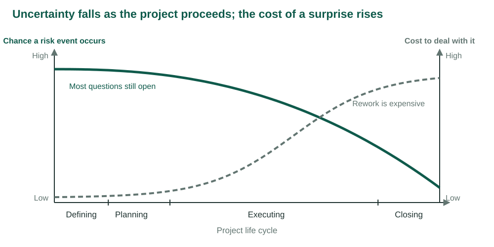
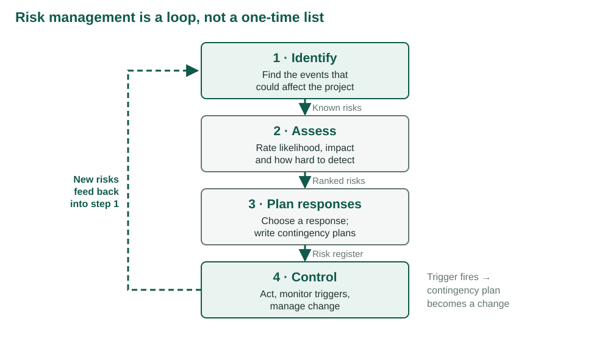
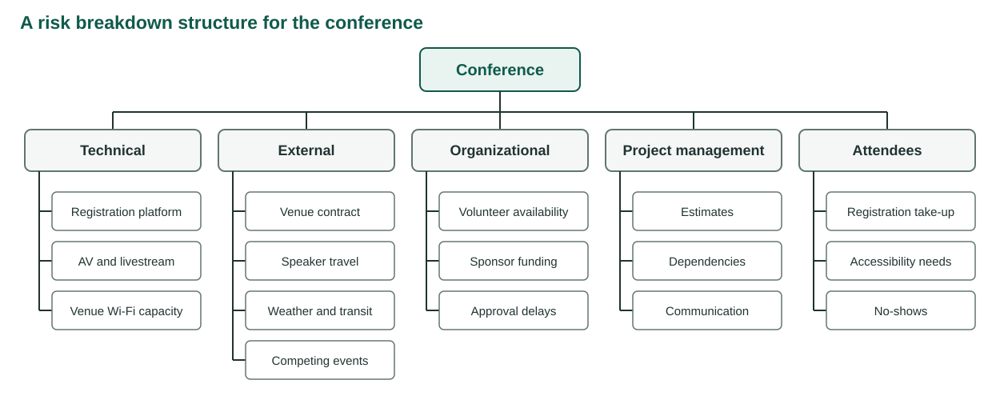
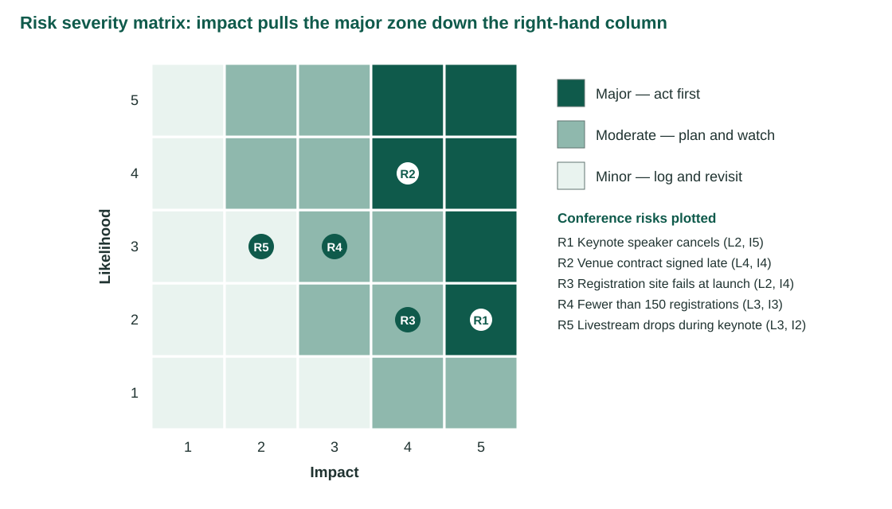
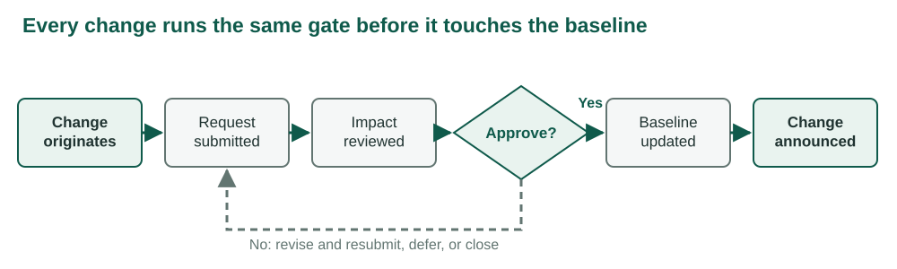
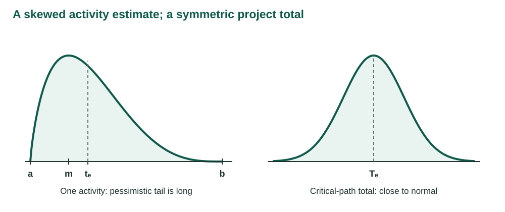
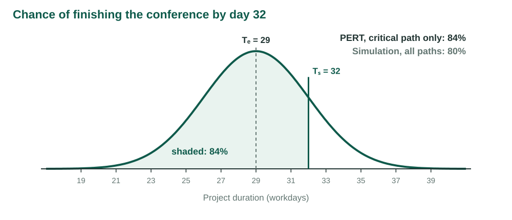

## {.center}

> A plan states what should happen. A risk plan states what you will do when it does not.

*Following Larson & Gray, Ch. 7 and Appendix 7.1 [1]. Figures are redrawn from the chapter. The conference examples are original to this course.*

## What this week adds to the plan

Weeks 5 and 6 produced estimates and a schedule. Every number in them rests on an assumption.

. . .

Risk management asks three questions about those assumptions:

- Which of them could fail?
- What would it cost if one did?
- What will we do about it, before and after?

## Learning objectives

| | |
|---|---|
| **LO 7-1** | Describe the risk management process |
| **LO 7-2** | Identify project risks as events |
| **LO 7-3** | Assess which risks deserve attention |
| **LO 7-4** | Describe the five responses to a threat |
| **LO 7-5** | Explain what a contingency plan adds |

## Learning objectives

| | |
|---|---|
| **LO 7-6** | Describe the five responses to an opportunity |
| **LO 7-7** | Use contingency funds and time buffers |
| **LO 7-8** | Keep risk management running |
| **LO 7-9** | Describe the change control process |
| **LO A7-1** | Calculate PERT probabilities |

# LO 7-1 · The risk management process

::: {.aside}
Following Larson & Gray, Ch. 7, Section 7.1, Figures 7.1 and 7.2
:::

## A risk is an uncertain event

A **risk event** is something that *may* happen and would change the project's cost, time or scope if it did.

. . .

Not a certainty. A problem you already have is solved now, not planned for.

. . .

Not an outcome. "The project is late" is a result, not an event.

## Risk falls, the cost of a surprise rises

<figure>

</figure>

## Why risk work is front-loaded

Early: most questions are still open, but a change of plan is cheap. A design flaw found on paper is an edit.

. . .

Late: few questions remain, but a surprise means rework. The same flaw found after the prototype means rebuilding.

. . .

Planning buys the most protection for the least money.

## Proactive, not reactive

Risk management is preventive work. Done well, it gives the project:

- fewer surprises;
- smaller damage when one still arrives;
- prepared moves instead of improvisation; and
- the readiness to act on good news as well as bad.

## Whose risk is it?

| Risk source | Who manages it | Paid from |
|---|---|---|
| Inflation, exchange rates, regulation, market demand | Senior management, before approval | Management reserve |
| Venue, speakers, registration, vendors, estimates | The project team | Project budget and contingency reserve |

The first row is weighed before the project is approved. This week concentrates on the second.

## Four steps, one loop

<figure>

</figure>

## What each step produces

| Step | Question | Output |
|---|---|---|
| 1 · Identify | What events could affect the project? | A list of candidate events |
| 2 · Assess | How likely, how damaging, how hard to see coming? | A ranked list |
| 3 · Plan responses | What do we do before, and what if it happens anyway? | The risk register |
| 4 · Control | Is the plan working, and what has changed? | Executed plans, new risks, change requests |

## The risk register

The document that carries all four steps. One row per risk event:

- the event, its cause and its effect
- likelihood, impact and detection ratings
- the response and the contingency plan
- the trigger and the owner

. . .

A register written once and filed has stopped being risk management.

# LO 7-2 · Identify risks

::: {.aside}
Following Larson & Gray, Ch. 7, Section 7.2, Figures 7.3 and 7.4
:::

## Identification is a group activity

- The project manager convenes the core team and the stakeholders who know the work.
- Groups judge risks more accurately than individuals do [5].
- Breadth first. An event that sounds absurd is cheap to discard later; an event nobody mentioned cannot be planned for.

## Events, not outcomes

The commonest mistake is to list the result you fear instead of the event that would cause it.

| Outcome stated as a risk | Events that could cause it |
|---|---|
| The conference opens late | Venue contract signed late; keynote cancels |
| We go over budget | Catering minimums rise; AV adds a surcharge |
| Attendance is low | A competing event is announced the same week |

. . .

An outcome suggests no action. An event does.

## A usable risk statement

*Because* the venue's legal team reviews contracts monthly,

*the contract may be signed late,*

*which would delay registration opening.*

. . .

Cause → event → effect. If a sentence has no cause, it is probably an outcome.

## Risk breakdown structure

An **RBS** divides the sources of risk into categories, as the WBS divides the work.

<figure>

</figure>

## Use the RBS from the top down

- Start with risks to the whole project: funding, market, sponsor support.
- Then descend to the work packages.
- Ask which category is empty. That is where the team has not looked yet.

## A risk profile asks standing questions

A **risk profile** is a checklist of questions an organization refines from one project to the next.

| Area | Question |
|---|---|
| Requirements | Has the sponsor said what success looks like, in numbers? |
| Suppliers | Which vendor failure leaves no substitute in two weeks? |
| Schedule | What depends on another organization's calendar? |
| Budget | Which costs are quoted, and which are guesses? |
| Authority | Who can sign a contract, and how long does it take? |

## The pre-mortem

Do not ask what *might* go wrong.

. . .

Assume the project *has* failed, and explain why [2].

. . .

Doubting a plan the group just approved feels disloyal. Explaining a failure that has been declared a fact does not.

## It is the morning after the conference

Attendance was half the target.

The keynote spoke to an empty overflow room.

The sponsor has asked for a written account of what went wrong.

## Write the failure story

Five minutes. Silent. Individual.

. . .

Five sentences explaining why the conference failed.

## Convert the story to risks

| Story sentence | Cause | Event | Effect |
|---|---|---|---|
| "Registration opened two weeks late" | Contract review is monthly | Venue contract signed late | Registration delayed |

. . .

Which of your events are missing from the RBS?

# LO 7-3 · Assess which risks deserve attention

::: {.aside}
Following Larson & Gray, Ch. 7, Section 7.3, Figures 7.5 to 7.7
:::

## Not every risk deserves attention

Identification produces more risks than anyone can manage.

. . .

Assessment sorts them: drop the trivial, merge the duplicates, rank the rest.

## Scenario analysis

The most common method. For each event, describe what would happen, then rate:

- **likelihood** that the event occurs
- **impact** on the project's objectives

. . .

Define the scales first. A rating of 4 means nothing until everyone agrees what a 4 is.

## Impact scale

| | 1 | 2 | 3 | 4 | 5 |
|---|---|---|---|---|---|
| **Cost** | Negligible | <10% | 10–20% | 20–40% | >40% |
| **Time** | Negligible | <5% | 5–10% | 10–20% | >20% |
| **Scope** | Barely noticed | Minor areas | Major areas | Sponsor rejects | Useless |

Thresholds are a policy choice. When an event hits more than one objective, rate it on the worst.

## The chapter's example: an operating-system upgrade

| Risk event | Likelihood | Impact | Zone |
|---|:-:|:-:|---|
| Interface problems | 4 | 4 | Major |
| System freezing | 2 | 5 | Major |
| User backlash | 4 | 3 | Moderate |
| Hardware malfunctioning | 1 | 5 | Moderate |

Ratings from Larson & Gray, Figures 7.6 and 7.7 [1]. Two of the four are rated unlikely and still rank high.

## Risk severity matrix

<figure>

</figure>

## Reading the matrix

- **Major zone**, top right: act first.
- **Moderate zone**, down the middle: plan and watch.
- **Minor zone**, bottom left: log it; revisit only if the ratings change.

. . .

The zones set the order of work. They do not say what the work is.

## Why the zones lean right

A 10% chance of losing $1,000,000 is a worse risk than a 90% chance of losing $1,000.

. . .

Impact weighs more than likelihood, so the major zone runs further down the high-impact column.

. . .

That is why R1, a keynote cancellation rated unlikely, still lands in the major zone.

## FMEA adds detection

**Failure mode and effects analysis** adds a third rating: how hard the event is to detect in time to act.

**RPN = Impact × Likelihood × Detection difficulty**

Each rating runs 1 to 5. Detection: 1 = seen weeks ahead, 5 = found only when it hits.

## The conference's five risks

| Risk | L | I | D | RPN |
|---|:-:|:-:|:-:|--:|
| R1 Keynote cancels | 2 | 5 | 2 | 20 |
| R2 Venue contract late | 4 | 4 | 2 | 32 |
| R3 Registration site fails | 2 | 4 | 4 | 32 |
| R4 Under 150 registrations | 3 | 3 | 3 | 27 |
| R5 Livestream drops | 3 | 2 | 5 | 30 |

A site that fails silently overnight (R3) outranks a louder, likelier risk because nobody would see it coming.

## The weakness of multiplication

R1 has the lowest RPN and the worst impact.

. . .

Trivial, likely, invisible: 1 × 5 × 5 = 25.

Catastrophic, likely, obvious: 5 × 5 × 1 = 25.

. . .

The numbers organize the discussion. They do not make the decision.

## Two risks, one number

R2 and R3 both score 32.

The venue risk is visible weeks ahead.

The registration failure appears at 9 a.m. on launch day.

. . .

Should they receive the same response budget?

## Probability analysis looks at the whole project

Event-by-event tools ask "will this happen?"

. . .

PERT and PERT simulation ask "how likely are we to finish on time and on budget?"

. . .

That answer sizes the contingency fund and the time buffer. Appendix 7.1, at the end of today.

# LO 7-4 · Five responses to a threat

::: {.aside}
Following Larson & Gray, Ch. 7, Section 7.4
:::

## Five responses

| Response | What it does | Conference example |
|---|---|---|
| Mitigate | Lowers likelihood or impact | Contract to legal in week 1; standby keynote |
| Avoid | Removes the event from the plan | Drop the livestream; record instead |
| Transfer | Moves the cost to another party | Cancellation insurance |
| Escalate | Hands it to whoever owns it | Sponsor travel freeze goes to the sponsor's executive |
| Retain | Accepts it deliberately | A severe winter storm on the day |

## Mitigate: two levers, in order

1. **Reduce the likelihood** that the event occurs. Teams start here.
2. **Reduce the impact** if it occurs anyway.

. . .

If the first lever makes the event unlikely enough, the costlier second one may never be needed.

## Avoid changes the plan

The event cannot happen because the plan no longer contains it.

- Proven technology instead of experimental technology.
- A concert moved indoors.
- A conference keynote recorded instead of livestreamed.

. . .

Not every risk can be avoided. Those that can are usually avoided before launch.

## Transfer and escalate change who owns it

**Transfer** moves who pays, not whether it happens. A fixed-price contractor adds a premium for the risk it takes on. Insurance costs a premium too.

. . .

**Escalate** sends a threat outside the project's scope or the manager's authority to the people who own it. An escalated risk leaves the register.

## Retain is a decision

A retained risk appears in the register with the reason it was retained.

. . .

Some risks are too large or too unlikely to transfer or reduce: an earthquake, a blizzard on the day.

. . .

A risk nobody listed has not been retained. It has been missed.

# LO 7-5 · Contingency plans

::: {.aside}
Following Larson & Gray, Ch. 7, Section 7.5, Figure 7.8
:::

## Response or contingency plan?

| | Response | Contingency plan |
|---|---|---|
| When it runs | Before the event, always | Only if the event occurs |
| Part of the baseline? | Yes | No |
| Paid from | Scheduled budget | Reserve |

## Plan, trigger, owner

A contingency plan has three parts:

- **the plan**: what runs when the event is recognized
- **the trigger**: an observable condition that says it has happened
- **the owner**: one named person who watches the trigger and can act

. . .

Miss any one and the plan exists only on paper.

## A trigger is observable

"If the speaker seems unreliable" is not a trigger.

. . .

"If the keynote has not confirmed travel 21 days out" is.

. . .

A trigger has a threshold and a date. Someone can check it and answer yes or no.

## Risk response matrix

| Risk | Response | Contingency | Trigger | Owner |
|---|---|---|---|---|
| R1 Keynote cancels | Standby speaker | Promote standby | No travel confirmation 21 days out | Program lead |
| R2 Venue late | Submit in week 1 | Release second venue hold | Unsigned 10 workdays after submission | Project manager |
| R3 Registration fails | Load test | Backup form | Error rate >2% in first hour | Systems lead |

Column structure follows Figure 7.8 [1].

# LO 7-6 · Opportunities

::: {.aside}
Following Larson & Gray, Ch. 7, Section 7.6; PMI [3]
:::

## An opportunity is a risk with a positive sign

An uncertain event that would *help*: a vendor cuts prices, a sponsor appears, a task finishes early.

. . .

Same process: identify, assess by likelihood and impact, plan a response, hold a contingency plan and fund.

. . .

Only the responses differ.

## Five responses to an opportunity

| Response | Mirrors | Conference example |
|---|---|---|
| Exploit | Avoid | Best coordinator on speaker confirmation, so it certainly finishes early |
| Share | Transfer | Co-host with a society that brings 100 registrations |
| Enhance | Mitigate | Venue whose rate falls if booked early |
| Escalate | Escalate | Second regional event referred to the department head |
| Accept | Retain | Free coffee offered: say yes, spend nothing chasing it |

# LO 7-7 · Contingency funds and time buffers

::: {.aside}
Following Larson & Gray, Ch. 7, Section 7.7, Table 7.1
:::

## Two reserves

| | Contingency reserve | Management reserve |
|---|---|---|
| Covers | Identified risks in the register | Unidentified and external risks |
| Sized from | The cost of specific contingency plans | A policy percentage or senior judgement |
| Controlled by | Project manager | Senior management |
| In the project budget? | Yes | Held above it |

## The conference budget

| | Baseline | Contingency | Project budget |
|---|--:|--:|--:|
| Work packages | $70,000 | $8,200 | $78,200 |
| Management reserve | | | $4,000 |
| **Total authorized** | | | **$82,200** |

Layout follows Table 7.1 [1]. Reserves sit in their own columns, never inside the estimates.

## Why reserves stay visible

A reserve buried in an activity estimate:

- cannot be tracked,
- tends to be spent whether or not the risk occurs, and
- repeats the padding problem from Week 5.

## Where time buffers go

A **time buffer** is schedule time held against delay. Add it:

1. after activities with severe risk
2. at merge activities, which inherit every predecessor's delay
3. on noncritical paths with little slack, so they do not become critical
4. before activities that need scarce resources

. . .

A buffer is a visible block, owned by the project manager.

# LO 7-8 · Risk management keeps running

::: {.aside}
Following Larson & Gray, Ch. 7, Figure 7.2, Step 4
:::

## Control is recurring work

- **Watch** the triggers on a fixed cadence, and report even when nothing happened.
- **Re-rate** as the project learns. The venue risk falls to minor once the contract is signed.
- **Add and retire** risks; release the reserve when a risk closes.
- **Record** what happened, for this project's baseline and the next project's risk profile.

. . .

A risk review belongs in the regular status meeting.

# LO 7-9 · Change control

::: {.aside}
Following Larson & Gray, Ch. 7, Section 7.9, Figures 7.9 and 7.10
:::

## Where changes come from

- **Scope changes**: new features, redesigns. Usually the largest.
- **Contingency plans being executed**: they move the cost and schedule baselines.
- **Improvements** proposed by the team.

. . .

Set the control process up during planning, before the first request arrives.

## One gate for every change

<figure>

</figure>

## What the gate does

1. Capture the proposed change.
2. Estimate its effect on schedule, cost and risk.
3. Review it and decide formally: approve, amend, reject or defer.
4. Tell everyone it affects, and assign who implements it.
5. Update the baseline and track the change to completion.

## The change request form

Originator, description and reason. Areas of impact: scope, cost, schedule, risk. Priority. Disposition. Sign-offs.

. . .

And one field that ties this to the reserves: **funding source**.

. . .

Customer, contingency reserve or management reserve. The form forces that choice to be made.

## A second keynote

Six weeks out, the sponsor asks for a second keynote, livestreamed to two partner campuses.

The program lead says yes by email.

. . .

What should have happened before that yes? Which objectives does it touch? Which reserve pays?

# LO A7-1 · PERT

::: {.aside}
Following Larson & Gray, Ch. 7, Appendix 7.1, Figures A7.1 to A7.3
:::

## Where PERT comes from

In 1958 the U.S. Navy's Polaris program had more than 3,300 contractors doing work no one had done before [1].

. . .

PERT keeps the CPM network from Week 6 and replaces each single duration with a range.

## Three estimates per activity

<figure>

</figure>

## Why the activity curve leans right

Work that falls behind tends to stay behind.

. . .

So the pessimistic tail is longer than the optimistic one, and the expected time sits to the right of the most likely time.

. . .

Add many such activities along a path and the total is close to normal.

## The formulas

**tₑ = (a + 4m + b) / 6**

**σ = (b − a) / 6**

**σ(path) = √(sum of σ² along the path)**

**Z = (Tₛ − Tₑ) / σ(path)**

a, m, b: optimistic, most likely and pessimistic estimates. Tₛ: the date being asked about.

Add variances, never standard deviations.

## The chapter's example

| Activity | *a* | *m* | *b* | tₑ | σ² |
|:-:|--:|--:|--:|--:|--:|
| A | 17 | 29 | 47 | 30 | 25 |
| B | 6 | 12 | 24 | 13 | 9 |
| C | 16 | 19 | 28 | 20 | 4 |
| D | 13 | 16 | 19 | 16 | 1 |
| E | 2 | 5 | 14 | 6 | 4 |
| F | 2 | 5 | 8 | 5 | 1 |

Values from Larson & Gray, Table A7.1 [1]. Critical path A–B–D–F, Tₑ = 64.

## Finish by 67?

σ(path) = √(25 + 9 + 1 + 1) = √36 = 6

. . .

Z = (67 − 64) / 6 = +0.50

. . .

The normal table gives 0.69. A 69% chance of finishing by 67.

. . .

By 60? Z = (60 − 64) / 6 = −0.67, about 25%.

## Reading the normal table

| Z | Probability | | Z | Probability |
|--:|--:|---|--:|--:|
| −1.00 | 16% | | +0.50 | 69% |
| −0.67 | 25% | | +1.00 | 84% |
| 0.00 | 50% | | +1.28 | 90% |
| | | | +2.00 | 98% |

Z counts standard deviations from Tₑ. Negative Z is a date earlier than expected.

## The conference with ranges

| ID | Activity | *a* | *m* | *b* | tₑ | σ² |
|:-:|---|--:|--:|--:|--:|--:|
| A | Event brief | 2 | 2 | 8 | 3 | 1 |
| B | Venue | 5 | 5 | 17 | 7 | 4 |
| C | Program draft | 3 | 6 | 9 | 6 | 1 |
| D | Registration | 4 | 4 | 16 | 6 | 4 |
| E | Speakers | 5 | 8 | 17 | 9 | 4 |

## The conference with ranges

| ID | Activity | *a* | *m* | *b* | tₑ | σ² |
|:-:|---|--:|--:|--:|--:|--:|
| F | Exhibitors | 2 | 5 | 8 | 5 | 1 |
| G | Publish program | 3 | 3 | 9 | 4 | 1 |
| H | Materials | 1 | 4 | 7 | 4 | 1 |
| I | Rehearsal | 2 | 2 | 8 | 3 | 1 |

Predecessors are unchanged from Week 6. Durations in workdays.

## Three paths

| Path | Σ tₑ | Σ σ² | σ |
|---|--:|--:|--:|
| A–C–E–G–H–I | **29** | 9 | 3.00 |
| A–B–D–G–H–I | 27 | 12 | 3.46 |
| A–C–F–H–I | 21 | 5 | 2.24 |

Tₑ = 29, σ = 3. Four days longer than Week 6's 25-day plan, because activities can run long by more than they can run short.

## How likely is the date?

| Tₛ | Z | Probability |
|--:|--:|--:|
| 26 | −1.00 | 16% |
| 29 | 0.00 | 50% |
| 32 | +1.00 | 84% |
| 33 | +1.33 | 91% |

A date set at Tₑ is a coin toss.

## The 90% date

Z = 1.28 leaves 90% of the curve to its left.

. . .

Tₛ = 29 + 1.28 × 3 ≈ 33 workdays.

. . .

A four-day time buffer over the expected duration.

## The curve

<figure>

</figure>

## What the single path leaves out

The venue path is shorter on average but has the largest variance.

. . .

On a bad run it becomes the longer path, and G waits for it.

. . .

PERT's formula ignores that, so it is always optimistic [4].

## PERT simulation

1. Draw a duration for every activity from its range.
2. Run the forward pass and record the finish.
3. Repeat thousands of times.

. . .

Output: the distribution of finish dates, the paths that became critical, and how often each activity was on one.

## PERT formula vs simulation

| Question | PERT formula | Simulation |
|---|--:|--:|
| Finish by day 29 | 50% | 44% |
| Finish by day 32 | 84% | 80% |
| 90% confidence | 33 days | 34 days |

200,000 simulated conferences.

## Criticality index

| Activities | Share of runs on the longest path |
|---|--:|
| A, G, H, I | 100% |
| C, E | 73% |
| B, D | 27% |
| F | 0% |

CPM calls B and D noncritical. One run in four, they decide the finish. That is the case for a buffer at the merge into G.

## Two ways to raise the odds

To improve the chance of meeting a date, the chapter offers two moves [1]:

1. **Spend now** to shorten one or more critical activities.
2. **Hold a contingency fund** and release it only if the schedule actually slips.

. . .

The chapter calls the second more prudent. It is not always.

## Spend now or hold a reserve?

Option 1: pay a vendor now to cut E's estimates to a = 5, m = 6, b = 11.

Option 2: hold $3,000 in contingency, spent only if E is not complete by day 15.

. . .

Does option 1 reach 90% by day 32? Which path would then need watching? When would option 2 be the wrong call?

## One row says it all

| Event | L · I · D | Zone | Response | Contingency | Trigger | Owner | Reserve |
|---|:-:|---|---|---|---|---|--:|
| Cause → event → effect | 2 · 5 · 2 | Major | Mitigate | Promote standby | 21 days, no confirmation | Program lead | $2,700 |

. . .

Every idea in this chapter is a column in this row. Thursday takes the last question of the day, how likely is the date, and teaches the method behind it.

# Thursday

## Studio 7 · How likely is the date?

1. Learn PERT on the chapter's example, step by step, in a spreadsheet.
2. Solve the chapter's Exercise 1 on your own: the National Holiday Toy project.
3. Interpret the number: the near-critical path, the merge, the 90% date.
4. Let Gemini solve it cold, then reconcile the two solutions.
5. Save your copy, then upload the PDF to Blackboard.

## 1 · The chapter's example, together

- tₑ and σ² for six activities
- the network from the predecessor column, and a forward pass on tₑ
- the critical path, Tₑ and σ(path)
- Z and probability for Tₛ = 67 and Tₛ = 60

. . .

Your sheet must match the chapter before you move on: Tₑ = 64, σ = 6, 69% and 25%.

## 2 · Exercise 1 on your own

Seven activities. Activity 6 is a merge with three predecessors.

- tₑ and σ² for each
- the network on paper, then the forward pass
- the critical path, Tₑ, the critical variances, σ(path)
- Z at 93 and the probability

. . .

Then every complete path: Σtₑ, Σσ², σ.

## 3 · Interpret

In at most 150 words:

- Which other path is closest in length, and how does its variance compare?
- Is the true chance of finishing by 93 higher or lower than the single-path figure? Use the merge at 6.
- What date gives 90% confidence, and how much buffer is that over Tₑ?

## 4 · Let the model solve it, then argue

Gemini gets the table cold and shows every step.

. . .

You compare line by line: each tₑ, each variance, the critical path, Tₑ, σ, Z, the probability.

. . .

For every difference, say who is right and why. Models often add standard deviations, or run the pass on m instead of tₑ.

## 5 · Save and upload

- One PDF: worked example, Exercise 1 sheet, network sketch, interpretation, reconciliation, AI acknowledgement
- Save your copy to the Google Drive or OneDrive on your NDSU account
- Then upload `SA7_yourlastname.pdf` to Blackboard before you leave

## Sources

1. Larson, E. W., & Gray, C. F. *Project Management: The Managerial Process*, 2024 Release. McGraw Hill. Chapter 7 and Appendix 7.1.
2. Klein, G. (2007). Performing a project premortem. *Harvard Business Review*, 85(9), 18–19.
3. Project Management Institute. (2017). *PMBOK® Guide* (6th ed.). Section 11.5.
4. MacCrimmon, K. R., & Ryavec, C. A. (1964). An analytical study of the PERT assumptions. *Operations Research*, 12(1), 16–37.
5. Sniezek, J. A., & Henry, R. A. (1989). Accuracy and confidence in group judgment. *OBHDP*, 43(1), 1–28.

::: {.aside}
The conference risks, budget, estimates and simulation are original to these course materials.
:::
